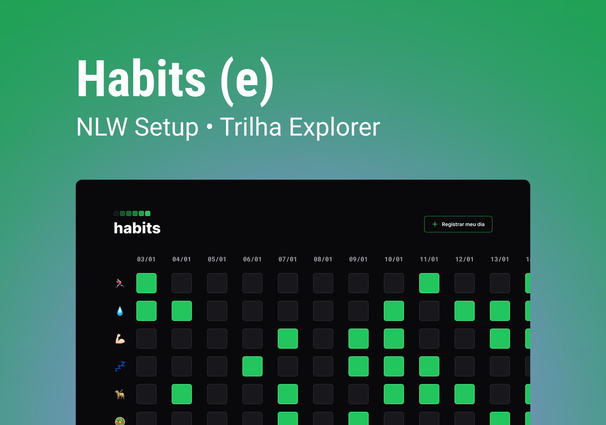

<h1 align="center"> App Controle de Hábitos </h1>

App feito com intuito de treinar alguns conhecimentos entre HTML, CSS E JAVASCRIPT  

  <a href="#-tecnologias">Tecnologias</a>&nbsp;&nbsp;&nbsp;|&nbsp;&nbsp;&nbsp;
  <a href="#-projeto">Projeto</a>&nbsp;&nbsp;&nbsp;|&nbsp;&nbsp;&nbsp;
  <a href="#-layout">Layout</a>&nbsp;&nbsp;&nbsp;|&nbsp;&nbsp;&nbsp;
  <a href="#memo-licença">Licença</a>

  

 

  

## 🚀 Tecnologias

Esse projeto foi desenvolvido com as seguintes tecnologias:

- HTML e CSS
- JavaScript
- Git e Github
- Figma

## 💻 Projeto

O App controle de hábitos é um aplicativos para usar no controle dos seus hábitos diários para adquirir mais qualidade de vida.

- [Acesse o projeto finalizado, online](https://github.com/RamirisonOliveira/app_controle_habitos)

## 🔖 Layout

Você pode visualizar o layout do projeto através [DESSE LINK](https://www.figma.com/file/goU6UM6u6hjs64AxKAnxjf/Habits-(e)-(Community)?node-id=75%3A567&t=9ox1IauCIuvK1COF-0). É necessário ter conta no [Figma](https://figma.com) para acessá-lo.

## :memo: Licença

Esse projeto está sob a licença ROL.

---

Feito by Ramirison Oliveira(https://github.com/RamirisonOliveira)